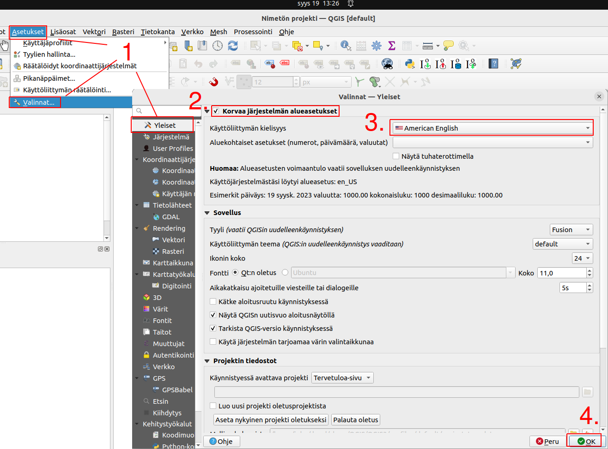

# Kappale 1: Perusteet

## Ennen tehtäviä

Kurssin materiaalit on tehty QGISin englanninkieliselle versiolle. Mikäli käytät QGISin suomenkielistä versiota, on suositeltavaa vaihtaa kieliasetus.



1.  Klikkaa **Asetukset** -\> **Valinnat** -\> **Yleiset**-välilehti.

2.  Klikkaa ruksi **Korvaa järjestelmän alue-** ruutuun.

3.  Valitse alasvetovalikosta kieleksi **American English**.

4.  Klikkaa **OK**.

5.  Käynnistä QGIS uudelleen. Kieliasetus vaihtuu vasta uudelleenkäynnistyksen jälkeen.

## Ratkaisuavain

Suorita seuraavat tehtävät niiden luonteesta riippuen joko QGISissä tai pohtimalla vastausta. Saat apua harjoituksiin kouluttajalta tai osassa tehtävissä painamalla 'Näytä vinkki'- painikkeesta. Kouluttaja antaa lopuksi harjoituksiin ratkaisuavaimen, joka pitää syöttää painamalla alla olevaa painiketta (tai painamalla alla olevia 'Näytä ratkaisu'- painikkeita). Kun avain on syötetty, voit katsoa mallivastaukset harjoituksiin.

<button onclick="enterToken()" class="btn">Syötä ratkaisuavain</button>

## Tehtävä 1.1

Tunnista, mitä

a)  lausekkeita
b)  funktioita

seuraava lauseke sisältää?

::: code-box
``` sql
"puhnro" = '+358' || substr("phonenumber",1,(length("phonenumber")-1))
```
:::

<button onclick="toggleAnswer(this)" class="btn answer_btn token">

ratkaisu

</button>

::: hidden-box
**a) Lausekkeet (sisin ensin):**

-   length("phonenumber")-1
-   "puhnro" = '+358' \|\| substr("phonenumber",1,(length("phonenumber")-1))

**b) Funktiot (sisin ensin):**

-   length()
-   substr()
-   \|\|
:::
