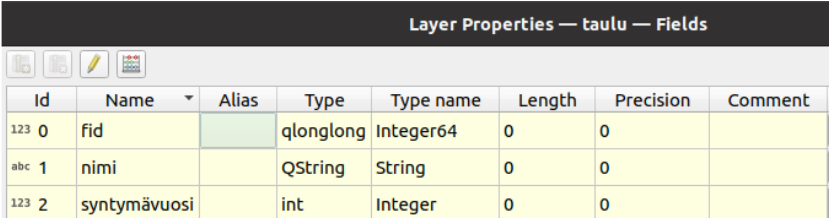

# Kappale 2: Lausekkeiden kirjoittaminen

## Ratkaisuavain

Suorita seuraavat tehtävät niiden luonteesta riippuen joko QGISissä tai pohtimalla vastausta. Saat apua harjoituksiin kouluttajalta tai osassa tehtävissä painamalla 'Näytä vinkki'- painikkeesta. Kouluttaja antaa lopuksi harjoituksiin ratkaisuavaimen, joka pitää syöttää painamalla alla olevaa painiketta (tai painamalla alla olevia 'Näytä ratkaisu'- painikkeita). Kun avain on syötetty, voit katsoa mallivastaukset harjoituksiin.

<button onclick="enterToken()" class="btn">Syötä ratkaisuavain</button>

## Tehtävä 2.1

Alla oleva lauseke ei toimi ilman funktiota `to_string()`. Mihin väliin se tarvitaan?

::: code-box
``` sql
upper(
    concat(
        if(
            "nimi"='Matti Matthias Meikäläinen', replace(
                'Matti Matthias Meikäläinen', 'Matthias', 'Matias'
                ), "nimi"
            ), ': ', "syntymävuosi"
        )
    )
```
:::

Tarkastele kuvasta tietotyyppejä:



<button onclick="toggleAnswer(this)" class="btn answer_btn">vinkki</button>

::: hidden-box
Kannattaa pohtia, mitä mikäkin lausekkeen sisältämä funktio saa syötteenä ja mitä se tuottaa ulos!
:::

<button onclick="toggleAnswer(this)" class="btn answer_btn token">ratkaisu</button>

::: hidden-box
Syntymävuoden datatyyppi on kokonaisluku (integer). `concat()`- funktion argumentit tulee olla merkkijonoja (string). Kokonaisluvut saa muutettua merkkijonoksi `to_string()` funktiolla.

::: code-box
``` sql
upper(
    concat(
        if(
            "nimi"='Matti Matthias Meikäläinen', replace(
                'Matti Matthias Meikäläinen', 'Matthias', 'Matias'
                ), "nimi"
            ), ': ', to_string(
            "syntymävuosi"
            )
        )
    )
```
:::
:::