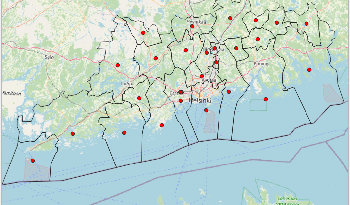
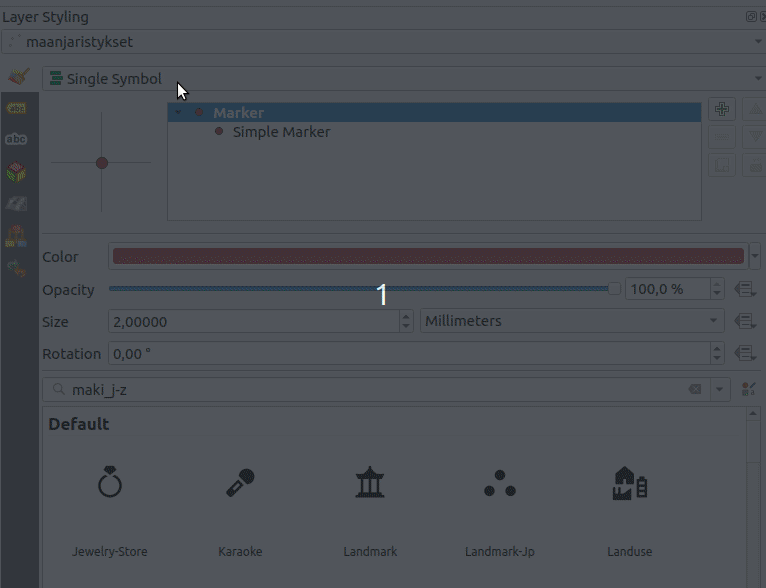
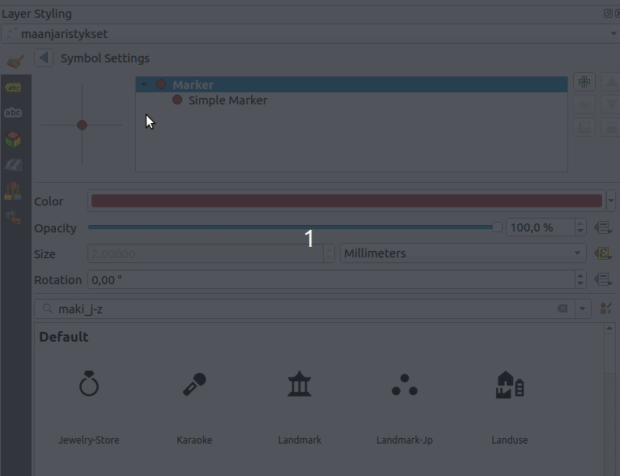

# Kappale 7: Symbologian kustomointi - lämpökartta ja Geometry Generator

## Ratkaisuavain

Suorita seuraavat tehtävät niiden luonteesta riippuen joko QGISissä tai pohtimalla vastausta. Saat apua harjoituksiin kouluttajalta tai osassa tehtävissä painamalla 'Näytä vinkki'- painikkeesta. Kouluttaja antaa lopuksi harjoituksiin ratkaisuavaimen, joka pitää syöttää painamalla alla olevaa painiketta (tai painamalla alla olevia 'Näytä ratkaisu'- painikkeita). Kun avain on syötetty, voit katsoa mallivastaukset harjoituksiin.

<button onclick="enterToken()" class="btn">Syötä ratkaisuavain</button>

## Tehtävä 7.1

Tarkastele Lipas- aineistoa. Luo frisbeegolfrata-tyyppisten liikuntakohteiden esiintyvyystiheyttä kuvaava lämpökartta.

- Käytä säteenä 5 km
  - Määrittää ympyränmuotoisen "vaikutusympäristön" jokaisen pisteen ympärille
  - Sopiva arvo riippuu pitkälti syötedatan sisällöstä

**Aineisto**: ```lipas_kohteet.gpkg```

<button onclick="toggleAnswer(this)" class="btn answer_btn">vinkki</button>

::: hidden-box
Muokkaa tason tyyliä seuraavasti joko tyylipaneelissa tai tason ominaisuuksissa > kuvaustekniikka (symbology):


Syötä ehkolauseke klikkaamalla epsilon- painikkeesta. Pisteen säde kerrotaan lausekkeen tuloksena olevalla painokertoimella. Millä lausekkeella saat vain frisbeegolfradat näkyviin?
:::


<button onclick="toggleAnswer(this)" class="btn answer_btn token">ratkaisu</button>

::: hidden-box
::: code-box
``` sql
if("tyyppi_nimi_fi"='Frisbeegolfrata', 1, 0)
```
:::
:::

## Tehtävä 7.2

Tarkastele hallintoalueaineistoa. Luo sille kuvan mukainen kuvaustekniikka käyttämällä Geometry Generatoria. Visualisoi oman maakuntasi kunnat sekä niiden painopisteet (kuvassa Uusimaa).

Huom! Tee maakuntaan perustuva suodatus Geometry Generatorilla, eikä muilla keinoilla.



**Aineisto**: ```hallintoalueet.gpkg```

<button onclick="toggleAnswer(this)" class="btn answer_btn">vinkki</button>

::: hidden-box
Täydennä symbolitasoja seuraavasti, siten että Geometry Generator- tasoja on kaksi. Toisen geometriatyyppi tulee olla viiva ja toisen piste.


Lisää seuraavaksi tekstikenttään lauseke, joka suorittaa maakuntaan perustuvan suodatuksen ja laskee painopisteet pistesymbolitasolle.
:::


<button onclick="toggleAnswer(this)" class="btn answer_btn token">ratkaisu</button>

::: hidden-box
::: code-box
``` sql
-- ulkorajat:
if(Maaku_ni1 = 'Uusimaa', boundary($geometry), 0)
-- painopisteet:
if(Maaku_ni1 = 'Uusimaa', centroid($geometry), 0)
```
:::
:::

## Tehtävä 7.3

::: todo
siirrä kpl 6 tehtäväksi?
:::

Tarkastele maanjäristysaineistoa. Visualisoi maanjäristykset siten, että niiden koko (millimetreinä) määräytyy järistyksen voimakkuuden perusteella (```Mag```). Lisää kuvaustekniikkaan myös symbolin väriin vaikuttava logiikka seuraavasti vuodenajan mukaan seuraavasti:

- Talvi: sininen
- Kevät: keltainen
- Kesä: vihreä
- Syksy: oranssi

**Aineisto**: ```maanjaristykset.gpkg```

<button onclick="toggleAnswer(this)" class="btn answer_btn">vinkki</button>

::: hidden-box
Käytä **Categorized**- luokittelua. Lisää pisteen koon määrittävä lauseke seuraavasti:



Määritä 'Categorized'- kuvaustekniikkaan lauseke seuraavasti:



Käytä lausekkeessa CASE WHEN- rakennetta (määritä vuodenajat kuukauden perusteella):

::: code-box
``` sql
CASE
WHEN ... (valitse talvikuukaudet)
THEN 'Talvi'
... (Määritä muut vuodenajat)
END
```
:::

Paina lopuksi **Classify** painiketta. Muokkaa symbolien värit tehtävänannon mukaisiksi kaksoisklikkaamalla eri luokkien symbolia.
:::


<button onclick="toggleAnswer(this)" class="btn answer_btn token">ratkaisu</button>

::: hidden-box
::: code-box
``` sql
-- Vaihe 1 (Symbolien koko):
"Mag" -- Lausekkeeksi riittää viittaus ```Mag``` (magnitudi)- kenttään

-- Vaihe 2 (luokitus):
CASE
WHEN "Mo" in (12, 01, 02)
THEN 'Talvi'
WHEN "Mo" in (03, 04, 05)
THEN 'Kevät'
WHEN "Mo" in (06, 07, 08)
THEN 'Kesä'
WHEN "Mo" in (09, 10, 11)
THEN 'Syksy'
END
```
:::
:::