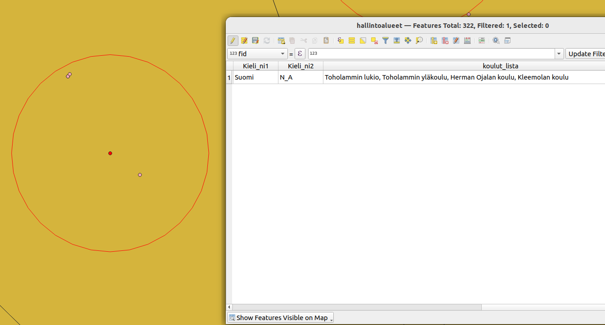

# Kappale 11: 

## Ratkaisuavain

Suorita seuraavat tehtävät niiden luonteesta riippuen joko QGISissä tai pohtimalla vastausta. Saat apua harjoituksiin kouluttajalta tai osassa tehtävissä painamalla 'Näytä vinkki'- painikkeesta. Kouluttaja antaa lopuksi harjoituksiin ratkaisuavaimen, joka pitää syöttää painamalla alla olevaa painiketta (tai painamalla alla olevia 'Näytä ratkaisu'- painikkeita). Kun avain on syötetty, voit katsoa mallivastaukset harjoituksiin.

<button onclick="enterToken()" class="btn">Syötä ratkaisuavain</button>

## Tehtävä 11.1

Luo funktio (anna sille nimeksi koululista), jonka avulla voidaan luoda lista oppilaitoksista, jotka sijaitsevat korkeintaan X m päässä hallintoalueiden keskipisteestä.

- Funktion syötteet (argumentit): muokattavan polygonitason nimi, hyödynnettävän pistetason nimi, sovellettava maksimietäisyys (esim. EPSG: 3067 tapauksessa metreinä)
- Tarvittavat rakennuspalikat: ```kohde```.geometry(), ```geometria-objekti```.centroid(), ```geometria-objekti```.distance(```geometria-objekti```)



**Aineistot**: 

- ```oppilaitokset.gpkg```
- ```hallintoalueet.gpkg```

Voit myös katsoa mallia esimerkkifunktioista:

<button onclick="toggleAnswer(this)" class="btn answer_btn">esimerkkifunktioita</button>

::: hidden-box
::: code-box
``` python
# Template for custom function modifying vector layer (name is taso1) so that its attribute field (name is kentta1) will always get
# the value it had previously + the constant we give to the function as parameter.

from qgis.core import *
from qgis.gui import *

@qgsfunction(args='auto', group='Custom', referenced_columns=[])
def function_name(layer_input1, field_name, value_input1, feature, parent):
    """
    Info text
    """
    # Saves the layer to be modified into a variable called layerva
    layer = QgsProject.instance().mapLayersByName(layer_input1)[0]

    # Adds a new column to the layer_inout1 with the name we specified as input
    layer_provider=layer.dataProvider()
    layer_provider.addAttributes([QgsField(field_name, QVariant.Integer)])
    layer.updateFields()

    col_ind = len(layer.fields().names()) - 1

    layer.startEditing()

    # Goes through all features in the layer (feat variable refers to each feature in the given layer once)
    # At each round, all the indented rows will be executed
    for feat in layerva.getFeatures():

        # Adds given value to the value of the given field of the current feature
        uusi = feat[field_input1] + value_input1

        id = feat.id()
        attr_value = {col_ind:uusi}
        layer_provider.changeAttributeValues({id:attr_value})

    layer.commitChanges()

    # Specifies what the function returns. As we only modify values of the layer > nothing gets returned
    return

# How to call this function from Expression window?

function_name(taso1, kentta1, 10)


# Template for custom function calculating the mean of the absolute value of the attribute field (name is kentta1)
# of the vector layer (name is taso1).

from qgis.core import *
from qgis.gui import *
# Import necessary python packages
import numpy

@qgsfunction(args='auto', group='Custom', referenced_columns=[])
def function_name(layer_input1, field_input1, feature, parent):
    """
    Info text
    """
    # Saves the layer to be modified into a variable called layerva
    layerva = QgsProject.instance().mapLayersByName(layer_input1)[0]

    # Saves the index of the field to be modified into a variable called field_idx
    field_idx = layerva.fields().indexOf(field_input1)

    # Creates an empty list
    lista = list()

    # Goes through all features in the layer (feat variable refers to each feature in the given layer once)
    # At each round, all the indented rows will be executed
    for feat in layerva.getFeatures():

    	# Conditional statement:
    	# if value of the given field for current feature is positive or zero, set temp variable to match current value
    	if feat[field_input1] >= 0:
    		temp = feat[field_input1]
    	# if value of the given field for current feature is not positive or zero, set temp variable to match current value multiplied with -1
    	else:
    		temp = -1 * feat[field_input1]

    	# Adds the value saved in the temp variable to the list called lista
        lista.append(temp)

        # Note that if we would also want to change the value of field_input1, we would use:
        #uusi_arvo = 99
        #layerva.changeAttributeValue(feat.id(), field_idx, uusi_arvo)

    # Calculates the mean of the values in the list and saves it to the variable called ka
    ka = numpy.mean(lista)
    
    # Specifies what the function returns (in this case a real value saved in the variable ka)
    return ka

# How to call this function from Expression window?

function_name(taso1, kentta1)
```
:::
:::

<button onclick="toggleAnswer(this)" class="btn answer_btn">vinkki</button>

::: hidden-box
Tallenna uusi funktio seuraavalla tavalla:


Käytä tätä pohjaa funktiolle:

::: code-box
``` python
from qgis.core import *
from qgis.gui import *

# Dekoraattorifunktio (@qgsfunction). Tärkeää määrittää usesgeometry avainsana-argumentti 'True':ksi
@qgsfunction(args='auto', group='Custom', referenced_columns=[], usesgeometry=True) 
def koululista(layer1, layer2, max_distance, feature, parent):
    """
    Returns list of schools located closer to the each administrative area's centroid than given distance.
    """
    admin_layer = ... # Tallenna annettu hallintoalue- taso muuttujaan.
    # Millä metodilla haet QGIS- projektin instanssista tason nimen perusteella?
    schools_layer = ... # Tallenna annettu oppilaitos- taso muuttujaan samalla tavalla.

    # Funktio suoritetaan joka kohteelle. Tällä hetkellä käsiteltävä kohde on 
    # automaattisesti tallennettu (@qgsfunction- dekoraattori) feature- muuttujaan.

    admin_centroid = ... # Laske painopiste hallintoalue- kohteelle. Millä metodilla voit laskea geometrialle painopisteen?
    
    # Käy läpi for- silmukasssa oppilaitoskohteet. Lisää kohteet listaan 'school_names', jos
    # kohteen hallintoalueen painopisteen etäisyys oppilaitoskohteesta on alle 'max_distance'- argumentin.
    # Voit käyttää joko "perinteistä" for- silmukkaa
    
    for school_feature in school_layer.(...): # Millä metodilla saat palautettua tason kohteet?
      if ...:
        ...
      
    # Tai "list comprehension"- toiminnallisuutta:
    
    school_names = [school_feature[...] for school_feature in school_layer.(...) if ...]

    result = ', '.join(school_names) # Yhdistä school_names listan alkiot, erottimena pilkku ja välilyönti
    
    if (result): # Jos tulos ei ole tyhjä merkkijono, palautetaan tulos
        return result
    else: # Jos tulos on tyhjä, palautetaan NULL
        return NULL
```
:::
:::

<button onclick="toggleAnswer(this)" class="btn answer_btn token">ratkaisu</button>

::: hidden-box
::: code-box
``` python
from qgis.core import *
from qgis.gui import *

@qgsfunction(args='auto', group='Custom', referenced_columns=[], usesgeometry=True)
def koululista(layer1, layer2, max_distance, feature, parent):
    """
    Returns list of schools located closer to the each administrative area's centroid than given distance.
    """
    admin_layer = QgsProject.instance().mapLayersByName(layer1)[0] # Tallenna annettu hallintoalue- taso muuttujaan
    schools_layer = QgsProject.instance().mapLayersByName(layer2)[0] # Tallenna annettu oppilaitos- taso muuttujaan

    admin_centroid = feature.geometry().centroid() # Laske painopiste hallintoalue- kohteelle
                                                   
    school_names = [school_feature['onimi'] for school_feature in schools_layer.getFeatures() # Käy läpi for- silmukassa oppilaitoskohteet ja
                   if admin_centroid.distance(school_feature.geometry()) < max_distance] # tarkista onko etäisyys painopisteeseen alle annetun argumentin

    result = ', '.join(school_names) # Yhdistä school_names listan alkiot, erottimena pilkku ja välilyönti
    
    if (result): # Jos tulos ei ole tyhjä merkkijono, palautetaan tulos
        return result
    else: # Jos tulos on tyhjä, palautetaan NULL
        return NULL
```
:::
:::