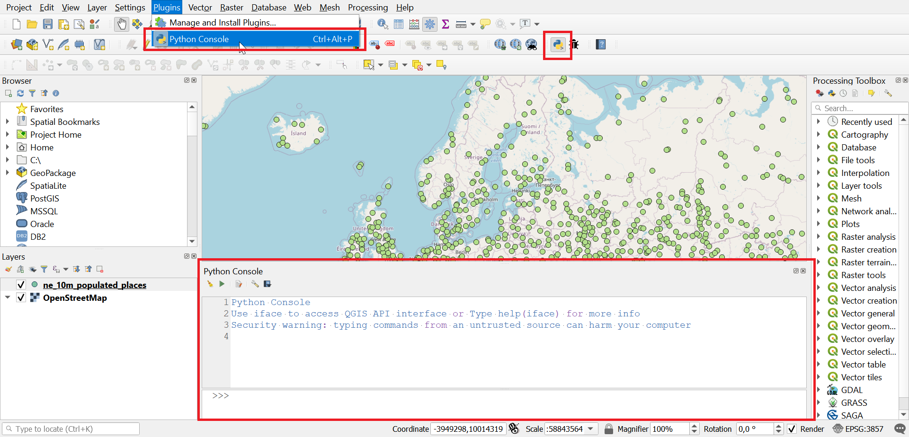

# Kappale 12: Python- konsoli

## Tehtävä 12.1

::: todo
Helpompi konsolissa tehtävä tehtävä
:::

## Tehtävä 12.2

Tutki alla olevaa skriptipohjaa. Selvitä itsellesi, mitä skriptillä pyritään saamaan aikaan. Luo tietokoneellesi uusi python (.py)- tiedosto ja kopio skriptipohja siihen. Tee tiedostoon kommentteina tallennetut muokkauspyynnöt (10 kpl). Avaa muokkaamasi tiedosto QGISin python-konsolissa ja suorita se.

<button onclick="toggleAnswer(this)" class="btn answer_btn">skriptipohja</button>

::: hidden-box
::: code-box
``` python
from qgis.core import *
from qgis.gui import *

layera = QgsProject.instance().mapLayersByName('natura_alueet')[0]
## 1. Luo layerb muuttuja, joka viittaa kunta-nimiseen karttatasoon
layerb =

# Create a new layer, specify the geometry type
layer = QgsVectorLayer('Polygon?crs=epsg:3067', 'tulostaso' , 'memory')

# Set the provider to accept the data source
prov = layer.dataProvider()

# Create the attribute fields
## 2. Lisää kolmas attribuutti, nimeltään area_dif ja tyypiltään Double
prov.addAttributes([QgsField("id",  QVariant.Int), QgsField("name",  QVariant.String)])
layer.updateFields()

## HUOM. Arvoksi pitäisi tulla ajettaessa 3
print("Ominaisuustietosarakkeita yhteensä:")
print(len(layer.fields()))

# Initialize the variables before entering for loop
laskuri = 0
tempsum = 0

# Goes through all features in the layera (feat variable refers to each feature in the given layer once)
# At each round, all the indented rows will be executed
for a in layera.getFeatures():
    # Get the geometry of feature a
    kpl = a.geometry()
    # Goes through all features in the layerb (feat variable refers to each feature in the given layer once)
    # At each round, all the indented rows will be executed
    for b in layerb.getFeatures():
        ## 3. Tallenna kohteen b geometriaobjekti muuttujaan kpl2
        kpl2 =
        ## 4. Luo ehto, jonka sisään päätyy vain jos kpl leikkaa kpl2:sta
        if :
            ## 5. Kasvata laskuri muuttujan arvoa, joka kerta, kun kpl leikkaa kpl2:sta
            laskuri =
            # The intersecting part as a geometry object
            geomleik = kpl.intersection(kpl2)
            ## 6. Tallenna geomhu-nimiseen muuttujaan geomleik objektin konveksi peite (convex hull)
            geomhu =
            ## 7. Laske, kuinka paljon isompi konveksin peitteen pinta-ala on verrattuna geomleik ja tallenna se muuttujaan temp
            temp =
            ## 8. Pidä yllä tietoa siitä, kuinka paljon uutta pinta-alaa on syntynyt tähän mennessä konveksien peitteiden luonnista
            tempsum =
            # Add new feature to the layer
            feat = QgsFeature()
            ## 9. Muokkaa siten, että ao. käsky asettaa myös area_dif attribuuttikentän arvoksi temp muuttujan sisältämä arvo
            feat.setAttributes([laskuri, a['Nimi']])
            # Set geometry for the new feature to be added to the layer
            ## 10. Lisää sen muuttujan nimi (sulkeiden sisään), josta geometriatieto tulee hakea, jotta uuden tason kohteiden
            ## geometriat tulevat vastaamaan leikkaavien polygonien konvekseja peitteitä
            feat.setGeometry()
            # Add new feature to the layer
            prov.addFeatures([feat])
            # Update extent of the layer
            layer.updateExtents()

print("Konveksin peitteen luomisesta seurasi")
# Convert m2 to km2
print(round((tempsum / 1000000.0), 1))
print("km2 pinta-alan lisäys.")
 
# Add the layer to the Layers panel
QgsProject.instance().addMapLayers([layer])
```
:::
:::

**Aineistot**: 

- ```natura_alueet.gpkg```
- ```hallintoalueet.gpkg``` **HUOM!** Valitse kaksi itseäsi kiinnostavaa kuntaa ja tallenna omaksi geopackageksi, jonka nimi on 'kunta.gpkg'

<button onclick="toggleAnswer(this)" class="btn answer_btn">vinkki</button>

::: hidden-box
Täydennä skriptipohjaan merkityt kohdat.


1. Avaa Python- konsoli.
2. Avaa Python- skriptieditori.
3. Avaa luomasi Python- tiedosto.
4. Aja skripti.
:::

<button onclick="toggleAnswer(this)" class="btn answer_btn">ratkaisu</button>

::: hidden-box
Skripti:

- tarkistaa onko hallintoaluekohteen sisällä Natura-alue(ita)
- leikkaa (intersection) Natura-aluekohteen kunnan rajojen mukaisesti
- luo leikatulle Natura-aluekohteen geometrialle konveksin peitteen (Convex Hull)
- laskee kuinka paljon suurempi Convex Hull on verrattuna leikattuun kohteeseen ja tallentaa sen uuden kohteen attribuuttitauluun
- tallentaa uudet kohteet väliaikaiselle 'tulostaso':lle

Täydennetty skripti:

::: code-box
``` sql
from qgis.core import *
from qgis.gui import *

layera = QgsProject.instance().mapLayersByName('natura_alueet')[0]
layerb = QgsProject.instance().mapLayersByName('kunta')[0]

# Create new layer, specify the geometry type
layer = QgsVectorLayer('Polygon?crs=epsg:3067', 'tulostaso' , 'memory')

# Set the provider to accept the data source
prov = layer.dataProvider()

# Create the attribute fields
prov.addAttributes([QgsField("id",  QVariant.Int), QgsField("name",  QVariant.String), QgsField("area_dif",  QVariant.Double)])
layer.updateFields()

print("Ominaisuustietosarakkeita yhteensä:")
print(len(layer.fields()))

# Initialize the variables before entering for loop
laskuri = 0
tempsum = 0

# Goes through all features in the layera (feat variable refers to each feature in the given layer once)
# At each round, all the indented rows will be executed
for a in layera.getFeatures():
    # Get the geometry of feature a
    kpl = a.geometry()
    # Goes through all features in the layerb (feat variable refers to each feature in the given layer once)
    # At each round, all the indented rows will be executed
    for b in layerb.getFeatures():
        # Get the geometry of feature b
        kpl2 = b.geometry()
        # Check if kpl intersects with kpl2
        if kpl.intersects(kpl2):
            # Counter to stay track on how many intersecting features we have found
            laskuri = laskuri + 1
            # The intersecting part as a geometry object
            geomleik = kpl.intersection(kpl2)
            # Create the convex hull of the intersecting geometry object
            geomhu = geomleik.convexHull()
            # Calculate the increase on area size when moving from intersecting object to its convex hull
            temp = geomhu.area() - geomleik.area()
            # Stay track on the total increase on area size
            tempsum = tempsum + temp
            # Add new feature to the layer
            feat = QgsFeature()
             # Set attribute values for the new feature to be added to the layer
            feat.setAttributes([laskuri, a['Nimi'], temp])
            # Set geometry for the new feature to be added to the layer
            feat.setGeometry(geomhu)
            # Add new feature to the layer
            prov.addFeatures([feat])
            # Update extent of the layer
            layer.updateExtents()

print("Konveksin peitteen luomisesta seurasi")
# Convert m2 to km2
print(round((tempsum / 1000000.0), 1))
print("km2 pinta-alan lisäys.")
 
# Add the layer to the Layers panel
QgsProject.instance().addMapLayers([layer])
```
:::
:::