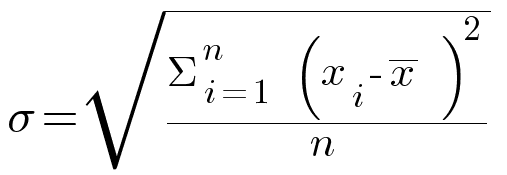
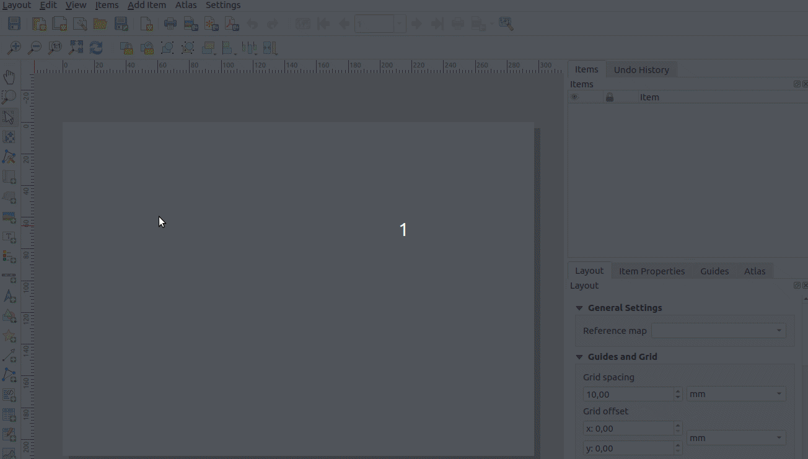
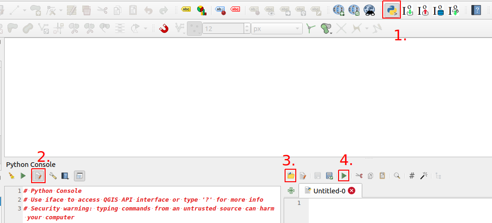

# Kotitehtävät

## Ratkaisuavain

Suorita seuraavat tehtävät niiden luonteesta riippuen joko QGISissä tai pohtimalla vastausta. Saat apua harjoituksiin kouluttajalta tai osassa tehtävissä painamalla 'Näytä vinkki'- painikkeesta. Kouluttaja antaa lopuksi harjoituksiin ratkaisuavaimen, joka pitää syöttää painamalla alla olevaa painiketta (tai painamalla alla olevia 'Näytä ratkaisu'- painikkeita). Kun avain on syötetty, voit katsoa mallivastaukset harjoituksiin.

<button onclick="enterToken()" class="btn">Syötä ratkaisuavain</button>

## Kotitehtävä 1

Tarkastele tieviiva-aineistoa. Laske kullekkin tielle sen 50m vyöhykkeen (buffer) pinta-ala uuteen sarakkeeseen.

**Aineisto**: ```tieviiva_suomi.gpkg```


<button onclick="toggleAnswer(this)" class="btn answer_btn">vinkki</button>

::: hidden-box
- Käytä ```buffer()```- funktiota.
- Millä funktiolla voit laskea pinta-alan?
:::

<button onclick="toggleAnswer(this)" class="btn answer_btn token">ratkaisu</button>

::: hidden-box
::: code-box
``` sql
area(
	buffer(
		$geometry, 50
		)
	)
```
:::
:::

## Kotitehtävä 2

Tarkastele Helsingin alueen väestöruutuaineistoa. Hyödynnä lausekkeita ja laske ruutukohtaisen asukasmäärän (```asukkaita```- kenttä) keskihajonta.

**Aineisto**: ```hsy_vaesto2020_muok.gpkg```


<button onclick="toggleAnswer(this)" class="btn answer_btn">vinkki</button>

::: hidden-box
- Käytä ```buffer()```- funktiota.
- Millä funktiolla voit laskea pinta-alan?
:::

<button onclick="toggleAnswer(this)" class="btn answer_btn token">ratkaisu</button>

::: hidden-box
::: code-box
``` sql
area(
	buffer(
		$geometry, 50
		)
	)
```
:::
:::

## Kotitehtävä 3 (haastava)

Luo hallintoalueaineistoon uusi attribuuttikenttä, jonka arvo vaihtelee sen mukaan sijaitseeko kullakin hallintoalueella Natura-alueita ja, jos sijaitsee, onko luonnonsuojelualueita yli 10km² alalta.

Käytä seuraavaa logiikkaa: jos hallintoalueella

- on Natura-alueita yli 10km² alalta > arvoksi hallintoalueella osuvien Natura-alueiden lukumäärä
- on Natura-alueita, mutta ei kuitenkaan yli 10km² alalta > arvoksi hallintoalueella osuvien Natura-alueiden lukumäärä kerrottuna -1:llä
- ei ole Natura- alueita > arvoksi 0

**Aineistot**: 

- ```hallintoaluee.gpkg```
- ```natura_alueet.gpkg```


<button onclick="toggleAnswer(this)" class="btn answer_btn">vinkki</button>

::: hidden-box
Käytä CASE WHEN ... rakennetta.

- Leikkaako (intersects) Natura-alue taso hallintoalue tason. Helpointa käyttää ```overlay_intersects()```- funktiota.
- JA onko pinta-ala yli 10km² (huomioi yksikkö). Aggregoi Natura-alueiden geometriat ja laske niille pinta-ala.
  - Käytä ```aggregate()```- funktiota. 
  - Kerää (collect) Natura-alueet tasolta geometriat (```$geometry```).
  - Suodata (filter) sen perusteella leikkaako tällä hetkellä käsiteltävän hallintoalueen geometria Natura-alueiden geometrioita
    - Käytä ```intersects()``` funktiota.
    - Hae hallintoaluekohteen geometria ```geometry()```- funktiolla.
    - Voit viitata tällä hetkellä käsiteltävään hallintoaluekohteeseen ```@parent```- muuttujalla.
  - Laske geometrioille pinta-ala ```area()```- funktiolla.
- Jos pinta-ala on yli 10km²...
  - Käytä jälleen ```aggregate()```- funktiota.
  - Laske kohteiden määrä (count). Käytä lausekkeena (expression) jotain natura_alueet- tason saraketta.
  - Suodata (filter) samalla tavalla kuin aikaisemmassa vaiheessa.
- Toista sama toimenpide, mutta tarkista onko pinta-ala alle 10km².
  - Jos on, kerro Natura-alueiden lukumäärä -1:llä
- Jos kumpikaan ehto ei toteudu (ELSE), aseta arvoksi 0

::: code-box
``` sql
CASE
WHEN
...
AND
...
THEN
...
WHEN
...
AND
...
THEN
...
ELSE 0
END
```
:::
:::

<button onclick="toggleAnswer(this)" class="btn answer_btn token">ratkaisu</button>

::: hidden-box
::: code-box
``` sql
CASE
WHEN
overlay_intersects(
	'natura_alueet'
	) = True
AND
area(
	aggregate(
		layer:='natura_alueet', aggregate:='collect', expression:=$geometry, filter:=intersects(
			geometry(
				@parent
				), $geometry
			)
		)
	) >= 10000000
THEN
aggregate(
	layer:='natura_alueet', aggregate:='count', expression:="Status", filter:=intersects(
		geometry(
			@parent
			), $geometry
		)
	)
WHEN
overlay_intersects(
	'natura_alueet') = True
AND
area(
	aggregate(
		layer:='natura_alueet', aggregate:='collect', expression:=$geometry, filter:=intersects(
			geometry(
				@parent
				), $geometry
			)
		)
	) < 10000000
THEN
-1 * ( aggregate(
	layer:='natura_alueet', aggregate:='count', expression:="Status", filter:=intersects(
		geometry(
			@parent
			), $geometry
		)
	)
)
ELSE 0
END
```
:::
:::

## Kotitehtävä 4

Tarkastele globaalia aineistoa paikoista, joissa on asutusta. Luokittele kohteet sen mukaan, mikä on ko. paikassa vallitsevan aikavyöhykkeen (```TIMEZONE```- kenttä) ensimmäinen osamääritelmä (ennen ensimmäistä /- merkkiä).

**Aineisto**: ```pop_places.gpkg```

<button onclick="toggleAnswer(this)" class="btn answer_btn">vinkki</button>

::: hidden-box
Samaan tulokseen pääsee (ainakin) kahdella tavalla:

- **Vaihtoehto 1**:
  - Käytä ```substr()```- funktiota. Funktio "leikkaa" merkkijonosta palasen annetun merkkivälin perusteella.
  - Hae ```strpos()```- funktiolla ```/```- symbolin paikka käytä sitä ```substr()```- funktiossa merkkivälin loppuna.

- **Vaihtoehto 2**:
  - Käytä ```regexp_substr()```- funktiota. Funktioon tulee syöttää merkkijono ja Regex (Regular Expression)- lauseke.
:::

<button onclick="toggleAnswer(this)" class="btn answer_btn token">ratkaisu</button>

::: hidden-box
::: code-box
``` sql
-- Vaihtoehto 1
substr(
  "TIMEZONE", 0, strpos(
    "TIMEZONE", '/'
      ) -1
    )

-- Vaihtoehto 2
regexp_substr(
	"TIMEZONE", '(.*?)/'
	)
```
:::
:::

## Kotitehtävä 5

Luo duplikaatti hallintoalue-aineistosta. Tehtävässä 2.7 selvitimme hallintoalueiden (tai niiden alijoukon) asukasmäärät ja tallensimme ne asukkaita- nimiseen attribuuttikenttään. Luokittele sekä hallintoalue-karttataso että siitä luotu duplikaattitaso porrastusperusteisesti Equal Count (Quantile)- menetelmällä ja samalla väriskaalalla; ensimmäinen asukkaita- kentän arvojen perusteella ja toinen sellaisten arvojen perusteella, jotka saadaan kun asukkaita- kentän arvo suhteutetaan hallintoaluepolygonin pinta-alaan (km²). Mitä havaitset?

**Aineisto**: ```hallintoalueet.gpkg```

<button onclick="toggleAnswer(this)" class="btn answer_btn">vinkki</button>

::: hidden-box
Millä funktiolla saat palautettua kohteen pinta-alan?
:::

<button onclick="toggleAnswer(this)" class="btn answer_btn token">ratkaisu</button>

::: hidden-box
::: code-box
``` sql
-- area()- funktiolla
"asukkaita" / (area(
	$geometry
	) / 1000000.0)
	
-- suoraviivaisemmin $area- funktiolla

"asukkaita" / ($area / 1000000.0)
```
:::
:::

## Kotitehtävä 6

Tarkastele lentokenttäaineistoa. Muodosta lentokenttäkohteille niiden nimeä vastaava nimiö. Luo nimiö vain niille kohteille, jotka sijaitsevat Suomessa, Ruotsissa tai Norjassa. Mikäli lentokenttä sijaitsee Suomessa, aseta tekstin väriksi sininen ja käytä fonttikokoa 8. Mikäli lentokenttä sijaitsee Ruotsissa tai Norjassa, aseta nimiön väriksi harmaa ja kooksi 5. Kaikissa muissa tapauksissa aseta nimiön kooksi nolla.

**Aineisto**: ```lentokentat.gpkg```

<button onclick="toggleAnswer(this)" class="btn answer_btn">vinkki</button>

::: hidden-box
Käytä CASE WHEN ... - rakennetta.

**Koon määrittäminen**:

- Valitse ```country```- sarakkeesta Suomi, Ruotsi ja Norja ja aseta niille tehtävänannossa kerrottu fonttikoko.

**Värin määrittäminen**:

- Valitse ```country```- sarakkeesta Suomi, Ruotsi ja Norja.
- Väri määritetään:
  - joko RGB (red, green, blue)- muodossa jossa luku 0-255 määrittää kunkin värin arvon, 
  - tai hexadesimaaliformaatissa (esim. '#000000')
  - tai osa väreistä voidaan kirjoittaa sanana ('red', 'blue') jne.
:::

<button onclick="toggleAnswer(this)" class="btn answer_btn token">ratkaisu</button>

::: hidden-box
::: code-box
``` sql
-- Koon määrittäminen
CASE
WHEN "country" = 'Finland'
THEN 8
WHEN "country" in ('Sweden', 'Norway')
THEN 5
ELSE 0
END

-- Värin määrittäminen
CASE
WHEN "country"='Finland'
THEN '0, 0, 255'
WHEN "country" in ('Sweden', 'Norway')
THEN '150, 150, 150'
END
```
:::
:::

## Kotitehtävä 7

Käytä QGISin kartta-atlas työkalua. Tuota kuvan mukainen karttatulostesarja Euroopan valtioille.



1. Luo uusi karttatuloste ja sille karttaikkuna, jonka sisältöä hallinnoi valtioaineiston perusteella luotu kartta-atlas.
  - Aseta kartta-atlaksen sivun nimeksi ADMIN-attribuuttikentän arvo
  - Hyödynnä kartta-atlaksen asetuksista löytyvää suodatusmahdollisuutta ja tarkastele vain Euroopan valtioita
2. Luo dynaaminen otsikkonimiö, joka on muotoa "Map .../50" (atlaksen sivu)
3. Luo dynaaminen karttatulostenimiö, johon muodostuu lista sen hetkisen atlas-sivun kattavuusobjektin alueelle osuvista lentokentistä (nimi-tieto kustakin, pilkulla erotettuina)
4. Säädä valtioiden näkyvyyttä siten, että vain atlas-sivun kattavuusobjektina toimiva valtio näkyy
5. Säädä lentokenttien näkyvyyttä siten, että vain atlas-sivun kattavuusobjektin alueella sijaitsevat lentokenttäkohteet kuvautuvat karttapohjalle

**Aineistot**: 

- ```valtiot.gpkg```
- ```lentokentat.gpkg```

<button onclick="toggleAnswer(this)" class="btn answer_btn">vinkki</button>

::: hidden-box
**Vaihe 1 Atlaksen ja karttaobjektin asetukset)**:



**Vaihe 2 (otsikko)**: ```@atlas_feature```- muuttuja kertoo sivunumeron.

**Vaihe 3 (lista lentokentistä)**:

- Käytä ```overlay_contains()```- funktiota. Hae sillä lentokenttien nimet. Funktio palauttaa tulokset ```Array```- datatyyppinä.
- Muuta ```Array``` merkkijonoksi (string). Millä funktiolla se onnistuu?

**Vaihe 4 (valtion näkyvyys)**:

- Tee sääntöpohjainen visualisointi valtioille. ```@atlas_pagename```- muuttuja kertoo tämänhetkisen sivun nimen.

**Vaihe 5 (lentokenttien näkyvyys)**:

- Tee sääntöpohjainen visualisointi lentokentille.
  - Millä funktiolla voit tarkastaa leikkaako lentokenttäpiste valtiopolygonin?
  - ```get_feature()```- funktiolla saat haettua toisen tason kohteen.
  - Millä funktiolla saat palautettua kohteen geometrian?
:::

<button onclick="toggleAnswer(this)" class="btn answer_btn token">ratkaisu</button>

::: hidden-box
::: code-box
``` sql
-- Atlaksen tarkasteltavien kattavuusobjektien suodatus
"CONTINENT" = 'Europe'

-- Dynaaminen otsikkonimiö (tekstikenttään)
[%
concat(
	'Map ', @atlas_featurenumber, '/', @atlas_totalfeatures
	)
%]

-- Dynaaminen karttatulostenimiö, jossa listaus atlas-objektin alueelle kuuluvista lentokentistä (tekstikenttään)
Valtio: [%
"ADMIN"
%]
Lentokentät: [%
array_to_string(
	array := overlay_contains(
		layer := 'lentokentat', expression := "NAME"
		), delimiter := ', '
	)
%]

-- Valtioiden näkyvyys
"ADMIN" = @atlas_pagename

-- Lentokenttien näkyvyys
intersects(
	$geometry, geometry(
		get_feature(
			'valtiot', 'ADMIN', @atlas_pagename
			)
		)
	)

```
:::
:::

## Kotitehtävä 8

Tutki alla olevaa skriptipohjaa. Selvitä itsellesi, mitä skriptillä pyritään saamaan aikaan. Luo tietokoneellesi uusi python (.py)- tiedosto ja kopio skriptipohja siihen. Tee tiedostoon kommentteina tallennetut muokkauspyynnöt (10 kpl). Avaa muokkaamasi tiedosto QGISin python-konsolissa ja suorita se.

<button onclick="toggleAnswer(this)" class="btn answer_btn">skriptipohja</button>

::: hidden-box
::: code-box
``` python
from qgis.core import *
from qgis.gui import *

layera = QgsProject.instance().mapLayersByName('natura_alueet')[0]
## 1. Luo layerb muuttuja, joka viittaa kunta-nimiseen karttatasoon
layerb =

# Create a new layer, specify the geometry type
layer = QgsVectorLayer('Polygon?crs=epsg:3067', 'tulostaso' , 'memory')

# Set the provider to accept the data source
prov = layer.dataProvider()

# Create the attribute fields
## 2. Lisää kolmas attribuutti, nimeltään area_dif ja tyypiltään Double
prov.addAttributes([QgsField("id",  QVariant.Int), QgsField("name",  QVariant.String)])
layer.updateFields()

## HUOM. Arvoksi pitäisi tulla ajettaessa 3
print("Ominaisuustietosarakkeita yhteensä:")
print(len(layer.fields()))

# Initialize the variables before entering for loop
laskuri = 0
tempsum = 0

# Goes through all features in the layera (feat variable refers to each feature in the given layer once)
# At each round, all the indented rows will be executed
for a in layera.getFeatures():
    # Get the geometry of feature a
    kpl = a.geometry()
    # Goes through all features in the layerb (feat variable refers to each feature in the given layer once)
    # At each round, all the indented rows will be executed
    for b in layerb.getFeatures():
        ## 3. Tallenna kohteen b geometriaobjekti muuttujaan kpl2
        kpl2 =
        ## 4. Luo ehto, jonka sisään päätyy vain jos kpl leikkaa kpl2:sta
        if :
            ## 5. Kasvata laskuri muuttujan arvoa, joka kerta, kun kpl leikkaa kpl2:sta
            laskuri =
            # The intersecting part as a geometry object
            geomleik = kpl.intersection(kpl2)
            ## 6. Tallenna geomhu-nimiseen muuttujaan geomleik objektin konveksi peite (convex hull)
            geomhu =
            ## 7. Laske, kuinka paljon isompi konveksin peitteen pinta-ala on verrattuna geomleik ja tallenna se muuttujaan temp
            temp =
            ## 8. Pidä yllä tietoa siitä, kuinka paljon uutta pinta-alaa on syntynyt tähän mennessä konveksien peitteiden luonnista
            tempsum =
            # Add new feature to the layer
            feat = QgsFeature()
            ## 9. Muokkaa siten, että ao. käsky asettaa myös area_dif attribuuttikentän arvoksi temp muuttujan sisältämä arvo
            feat.setAttributes([laskuri, a['Nimi']])
            # Set geometry for the new feature to be added to the layer
            ## 10. Lisää sen muuttujan nimi (sulkeiden sisään), josta geometriatieto tulee hakea, jotta uuden tason kohteiden
            ## geometriat tulevat vastaamaan leikkaavien polygonien konvekseja peitteitä
            feat.setGeometry()
            # Add new feature to the layer
            prov.addFeatures([feat])
            # Update extent of the layer
            layer.updateExtents()

print("Konveksin peitteen luomisesta seurasi")
# Convert m2 to km2
print(round((tempsum / 1000000.0), 1))
print("km2 pinta-alan lisäys.")
 
# Add the layer to the Layers panel
QgsProject.instance().addMapLayers([layer])
```
:::
:::

**Aineistot**: 

- ```natura_alueet.gpkg```
- ```hallintoalueet.gpkg``` **HUOM!** Valitse kaksi itseäsi kiinnostavaa kuntaa ja tallenna omaksi geopackageksi, jonka nimi on 'kunta.gpkg'

<button onclick="toggleAnswer(this)" class="btn answer_btn">vinkki</button>

::: hidden-box
Täydennä skriptipohjaan merkityt kohdat.


1. Avaa Python- konsoli.
2. Avaa Python- skriptieditori.
3. Avaa luomasi Python- tiedosto.
4. Aja skripti.
:::

<button onclick="toggleAnswer(this)" class="btn answer_btn token">ratkaisu</button>

::: hidden-box
Skripti:

- tarkistaa onko hallintoaluekohteen sisällä Natura-alue(ita)
- leikkaa (intersection) Natura-aluekohteen kunnan rajojen mukaisesti
- luo leikatulle Natura-aluekohteen geometrialle konveksin peitteen (Convex Hull)
- laskee kuinka paljon suurempi Convex Hull on verrattuna leikattuun kohteeseen ja tallentaa sen uuden kohteen attribuuttitauluun
- tallentaa uudet kohteet väliaikaiselle 'tulostaso':lle

Täydennetty skripti:

::: code-box
``` sql
from qgis.core import *
from qgis.gui import *

layera = QgsProject.instance().mapLayersByName('natura_alueet')[0]
layerb = QgsProject.instance().mapLayersByName('kunta')[0]

# Create new layer, specify the geometry type
layer = QgsVectorLayer('Polygon?crs=epsg:3067', 'tulostaso' , 'memory')

# Set the provider to accept the data source
prov = layer.dataProvider()

# Create the attribute fields
prov.addAttributes([QgsField("id",  QVariant.Int), QgsField("name",  QVariant.String), QgsField("area_dif",  QVariant.Double)])
layer.updateFields()

print("Ominaisuustietosarakkeita yhteensä:")
print(len(layer.fields()))

# Initialize the variables before entering for loop
laskuri = 0
tempsum = 0

# Goes through all features in the layera (feat variable refers to each feature in the given layer once)
# At each round, all the indented rows will be executed
for a in layera.getFeatures():
    # Get the geometry of feature a
    kpl = a.geometry()
    # Goes through all features in the layerb (feat variable refers to each feature in the given layer once)
    # At each round, all the indented rows will be executed
    for b in layerb.getFeatures():
        # Get the geometry of feature b
        kpl2 = b.geometry()
        # Check if kpl intersects with kpl2
        if kpl.intersects(kpl2):
            # Counter to stay track on how many intersecting features we have found
            laskuri = laskuri + 1
            # The intersecting part as a geometry object
            geomleik = kpl.intersection(kpl2)
            # Create the convex hull of the intersecting geometry object
            geomhu = geomleik.convexHull()
            # Calculate the increase on area size when moving from intersecting object to its convex hull
            temp = geomhu.area() - geomleik.area()
            # Stay track on the total increase on area size
            tempsum = tempsum + temp
            # Add new feature to the layer
            feat = QgsFeature()
             # Set attribute values for the new feature to be added to the layer
            feat.setAttributes([laskuri, a['Nimi'], temp])
            # Set geometry for the new feature to be added to the layer
            feat.setGeometry(geomhu)
            # Add new feature to the layer
            prov.addFeatures([feat])
            # Update extent of the layer
            layer.updateExtents()

print("Konveksin peitteen luomisesta seurasi")
# Convert m2 to km2
print(round((tempsum / 1000000.0), 1))
print("km2 pinta-alan lisäys.")
 
# Add the layer to the Layers panel
QgsProject.instance().addMapLayers([layer])
```
:::
:::